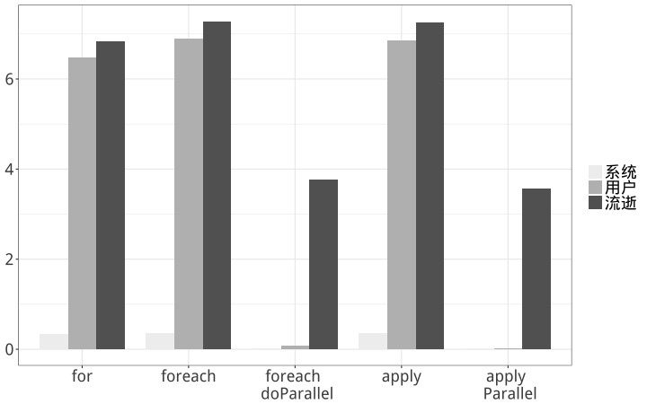

# 使用R实现并行最小二乘

## 1.生成数据

```R
n=10000
p=50
X=matrix(rnorm(n*p),nrow=n)
beta=matrix(runif(p,10,20),ncol=1)
y=X%*%beta+rnorm(n)
```
自变量为10000行50列，全部由正太分布随机数生成。参数50行1列，全部由均匀分布随机数生成。因变量为10000行1列。

## 2.使用最小二乘估计参数

```R
myfun=function(X,y,lambda=0.001){
  p=ncol(X)
  n=nrow(X)
  lam=diag(p)*lambda
  beta_hat=solve(t(X)%*%X+lam)%*%t(X)%*%y
  y_hat=X%*%beta_hat
  y_bar=mean(y)
  R_squre=sum((y_hat-y_bar)^2)/sum((y-y_bar)^2)
  return(list(coef=beta_hat,R_squre=R_squre))
}
ols=myfun(X,y)
ols$R_squre
data.frame(beta,beta_hat=ols$coef)
```

最小二乘估计出来的R方为99.9%

## 3.控制最小二乘函数不输出，计算使用for循环的运行时间。

```R
	t1=system.time(for(i in 1:100) myfun(X,y))
	t1=as.numeric(t1)[1:3]
```

## 4.调用foreach包，计算使用foreach的运行时间

```R
	library(foreach)
	t2=system.time(foreach(x=1:100,.combine='c') %do% myfun(X,y))
	t2=as.numeric(t2)[1:3]
```

## 5.调用doParallel包，使用两个核作为foreach运行的后段，计算此时的运行时间。

```R
	library(doParallel)
	cl=makeCluster(2)
	registerDoParallel(cl)
	t3=system.time(foreach(x=1:100,.combine='c') %dopar% myfun(X,y))
	stopCluster(cl)
	t3=as.numeric(t3)[1:3]
```

## 6.计算使用apply的运行时间

```R
	t4=system.time(sapply(1:100,function(x)myfun(X,y)))
	t4=as.numeric(t4)[1:3]
```

## 7.调用paralle包，计算使用两个核作为apply运行后段的运行时间。

```R
	library(parallel)
	cl=makeCluster(2)
	clusterExport(cl, list("myfun","X","y"), envir = environment())
	t5=system.time(parSapply(cl,1:100,function(x)myfun(X,y)))
	stopCluster(cl)
	t5=as.numeric(t5)[1:3]
```

## 8.观察上述5种方法下的运行时间。



如果不使用paralle或者doParallel调用计算核，for、apply以及foreach的计算速度相差不大。但是在使用parallel或者doParallel调用了计算核之后，系统运行时间显著下降了。
